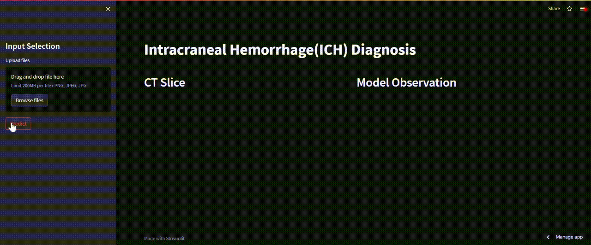
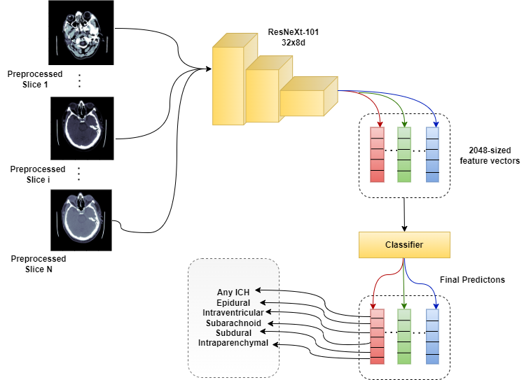

<h1 align="center">
Detection and Classification Of Intracraneal Haemorrhage 
</h1>

  
  
  

  <a href="#overview">Overview</a> •
  <a href="https://github.com/adiMallya/ichd/blob/main/notebooks/phase-II_review_ichd.ipynb">EDA Notebook</a> •
  <a href="#hardware">Hardware</a> •
  <a href="https://github.com/adiMallya/ichd/tree/main/src">Source code</a> •
  <a href="#final-results">Results</a> •
  <a href="https://github.com/adiMallya/ichd/tree/main/api">API</a>

    This is the source code for the project based on the <a href="https://www.kaggle.com/c/rsna-intracranial-hemorrhage-detection/overview">RSNA2019 Intracranial Hemorrhage Detection Challenge</a>

## Demo

  

## Overview

The AI-based diagnostic tool designed and implemented, is based on the ResNeXt-101 model. This model is fine-tuned for diagnosing an intracranial hemorrhage. We have a single image classifier (size `200` images with brain window), that returns predictions as probability scores across each of the five subtype labels (epidermal, intraventricular, intraparenchymal, subdural, subarachnoid), plus an additional type `"any"` (that would be true if any of the subtype labels is true). 

  

## Hardware

- Ubuntu 16.04 LTS
- Dell PowerEdge T630 server
- Single Node of 3 x NVIDIA GeForce GTX 1080Ti & a Titan Pascal
- Intel® Xeon® E5-2697, 2.3GHz, 18 cores
- 126 GB RAM

## Final results

- *Loss* : **0.04**
- *Accuracy* : **91.9%**
